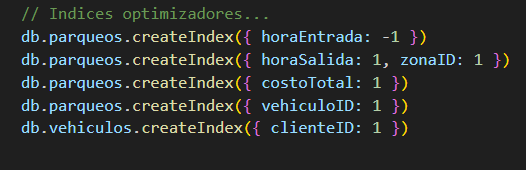
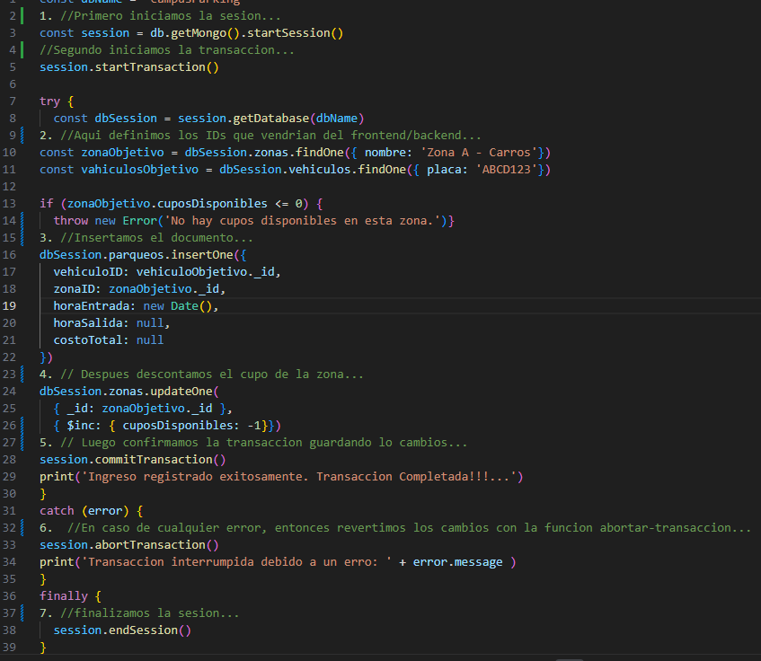
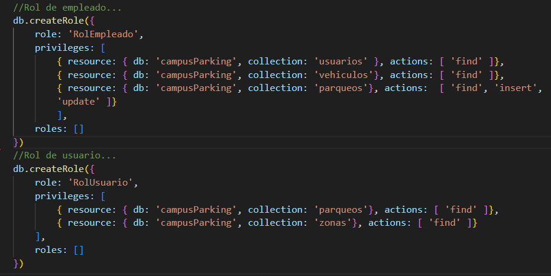

CAMPUS PARKING - SISTEMA DE GESTION DE PARQUEADORES

1. Introduccion al Proyecto...

    CAMPUS PARKING es un sistema de gestion centralizada para una red de parqueaderos distribuidos en multiples ciudades (Bogota, Medellin, Cali). El sistema permite administrar sedes, zonas de parqueo especializadas por tipo de vehiculo, control de usuarios (administradores, empleadoso y clientes), registro de vehiculos y el seguimiento en tiempo real del historial de parqueos, calculando dinamicamente los costos basados en el tiempo de estadia y la tarifa de cada zona.

2. Justificacion al uso de MongoDB...

    MongoDB se utiliza como base de datos principal por las siguiente razones:

        A. FLEXIBILIDAD DE ESQUEMAS: Permite manejar diferentes tipos de vehiculos y zonas con atributos variables sin requerir         migraciones complejas.

        B. ALTA VELOCIDAD DE ESCRITURA/LECTURA: El registro de entradas y salidas de vehiculos de la coleccion parqueos, es una operacion de alta frecuencia que se beneficia del rendimiento en operaciones transaccionales de MongoDB.

        C. CONSULTAS GEOESPACIALES Y JERARQUICAS: Facilita la escalabilidad futura si se requiere buscar parqueaderos cercanos o estructurar jerarquias complejas de sedes.

3. MODELO DE DATOS....

    Las colecciones creadas en total fueron 5 y son las siguientes:

        1. Coleccion SEDES: Incluye la informacion general de las ubicaciones fisicas.
        2. Coleccion ZONAS: Son las areas especificas dentrode cada sede (VIP, motos, bicicletas, etc.)
        3. Coleccion USUARIOS: Credenciales y datos personales de Administradores, Empleados y Clientes.
        4. Coleccion VEHICULOS: Incluye todos tipos de automotores registrados y vinculados a clientes especificos.
        5. Coleccion PARQUEOS: Es el registro transaccional de entradas, salidas y cobros de parqueo.

4. DECISIONES DE USO AL UTILIZAR REFERENCIAS O EMBEDIDOS...

    Se opto principalmente por un modelo normalizado mediante referencias por las siguientes razones de arquitectura:

            A. PARQUEOS (Referencias): Normalmente Un vehiculo o zona puede tener miles de registros de parqueo a lo largo del tiempo. EMBEDER los parqueos dentro del vehiculo solo crearia un Unbounded Array o arreglo ilimitado, superando el limite de 16MB por documento, degradando asi el rendimiento.

            B. ZONAS (Refencias a Sede): Las zonas referencian al ID de las sedes. Aunque se podrian embeder en sedes, mantenerlas separadas permite consultar la disponibilidad de zonas globales de manera mas eficiente.

            C. VEHICULOS (Referencias al Cliente): Los vehiculos referencia al ID de los clientes para mantener el documento del cliente ligero al momento de autenticarse.

5. VALIDACIONES...

    Se implemento validacion a nivel de base de datos para garantizar la integridad de la informacion ingresada.

    EXPLICACION DE VALIDACIONES POR COLECCION:

        COLECCION USUARIO: Se obliga a que todo usuario tenga nombre, cedula unica y un rol valido restringido a un enum.

        COLECCION PARQUEOS: Se exige el ID de vehiculo, zona y hora de Entrada. La hora de Salida y costo total pueden ser nulos indicando que el vehiculo sigue en el parqueadero, pero deben ser de tipo 'date' y 'number' respectivamente cuando se actualicen.

6. INDICIES...

    Lista de indices creados y justificacion tecnica:

    

    { horaEntrada: -1 }: Orden descendente. Justificación: Optimiza las consultas de los reportes diarios y la visualización del dashboard en tiempo real (últimos ingresos).

    { horaSalida: 1, zonaID: 1 } (Índice Compuesto): Justificación: Vital para la consulta de "Vehículos actualmente parqueados en la Zona X" (donde horaSalida es null).

    { costoTotal: 1 }: Justificación: Acelera las agregaciones financieras, reportes de ingresos y filtrado de tiquetes de alto valor.

    { vehiculoID: 1 } y { clienteID: 1 }: Justificación: Índices foráneos necesarios para hacer $lookup (JOINs) eficientes al buscar el historial de un cliente o vehículo específico.

7. ESTRUCTURA DE LOS DATOS DE PRUEBA:

    El script de inicializacion provee un entorno adecuado para generar y realizar pruebas:

        3 SEDES (Bogotá, Medellín, Cali).

        15 ZONAS de parqueo categorizadas por tipos de vehículos permitidos (Carros, Motos, Bicis, Camiones) y tarifas dinámicas.

        26 USUARIOS: 1 Administrador, 10 Empleados (asignados a sedes) y 15 Clientes.

        30 VEHICULOS vinculados aleatoriamente a los clientes.

        50 REGISTROS DE PARQUEO:

                15 Activos (horaSalida: null, simulando vehículos actualmente en el establecimiento).

                35 Históricos (con horas de salida calculadas y costo total liquidado). 

8. EXPLICACION DE CADA AGREGACION...

    Para el analisis de datos del modelo de negocio, se incluyeron los siguientes pipelines del framework de  agregacion:
    
        1.  Ingresos totales generados por Sede...
            Calcula cuánto dinero ha producido cada sede sumando los costoTotal de los parqueos finalizados, cruzando los datos entre parqueos, zonas y sedes.    

                db.parqueos.aggregate([
                { $match: { costoTotal: { $ne: null } } }, // Solo parqueos finalizados
                { $lookup: { from: "zonas", localField: "zonaID", foreignField: "_id", as: "zona_info" } },
                { $unwind: "$zona_info" },
                { $lookup: { from: "sedes", localField: "zona_info.sede_ID", foreignField: "_id", as: "sede_info" } },
                { $unwind: "$sede_info" },
                { $group: { _id: "$sede_info.nombre", ingresosTotales: { $sum: "$costoTotal" }, totalServicios: { $sum: 1 } } },
                { $sort: { ingresosTotales: -1 } }
                ])

        2. Ocupación actual por Zona
           Muestra cuántos vehículos están actualmente estacionados (horaSalida: null) agrupados por el nombre de la zona.

                db.parqueos.aggregate([
                { $match: { horaSalida: null } },
                { $lookup: { from: "zonas", localField: "zonaID", foreignField: "_id", as: "zona" } },
                { $unwind: "$zona" },
                { $group: { _id: "$zona.nombre", vehiculosParqueados: { $sum: 1 } } }
                ])

8. TRANSACCION MONGODB...

        Escenario utilizado:

            "Registro de 1 nuevo usuario, su vehículo y su primer ingreso al parqueadero.
            Este proceso requiere insertar datos en tres colecciones distintas (usuarios, vehiculos, parqueos). Si alguna falla (ej. el sistema se cae antes de registrar el parqueo), se debe hacer rollback para no dejar un cliente fantasma o un vehículo sin dueño."

            CODIGO EXPLICADO PASO A PASO:

    

9. ROLES....

        DESCRIPCION DE CADA ROL (Control de Acceso basado en Roles - RBAC)

            Ademas de los roles logicos en la coleccion 'USUARIOSS', se definen roles nativos de base de datos para la seguridad:

                A. ROL-ADMINISTRADOR: Acceso total (lectura, escritura, modificación de esquemas e índices).

                B. ROL-EMPLEADO: Permisos de lectura en sedes, zonas, y permisos de lectura/escritura en parqueos y vehiculos. No puede eliminar registros.

                C. ROL-USUARIO: Solo lectura para consulta de sus propios datos.

        EJEMPLOS DE CREACION DE USUARIOS CON ESOS ROLES:

// Creación de rol personalizado para el Empleado

10. CONCLUSIONES Y MEJORAS POSBILES....

        Conclusiones:

            La arquitectura basada en referencias protege el sistema contra la degradación de rendimiento por documentos superpoblados (anti-patrón de unbounded arrays).

            La implementación de $jsonSchema protege la integridad transaccional, evitando inconsistencias entre las horas de entrada y salida o cobros inválidos.

            Las consultas de facturación y ocupación están fuertemente optimizadas gracias a la estrategia de indexación compuesta.

        MEJORAS POSIBLES A FUTURO:

            Índices TTL (Time-To-Live): Implementar un índice TTL en la colección de parqueos para archivar o eliminar automáticamente registros con más de 5 años de antigüedad y ahorrar almacenamiento.

            Control de Concurrencia: Integrar lógica a nivel de backend para descontar en tiempo real los cuposDisponibles de una zona al registrar un parqueo, utilizando operadores $inc atómicos.

            Sharding (Fragmentación): Si el proyecto se expande a nivel nacional, se podría fragmentar la base de datos (Sharding key) utilizando sede_ID para que las operaciones de cada ciudad se ejecuten en servidores geográficamente cercanos, reduciendo la latencia.